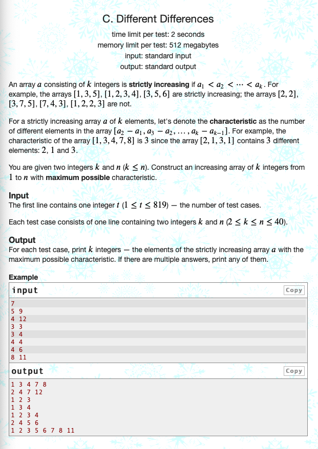

<a href ="https://codeforces.com/problemset/problem/1772/C" target="_blank">
<h2 class="header">
        1772. Different Differences
</h2>
</a>

<h3> Tags </h3>
<ul>
    <li>
        Constructive Algorithms
    </li>
    <li>
        Greedy
    </li>
    <li>
        Math
    </li>
    <li>
        1000
    </li>
</ul>

