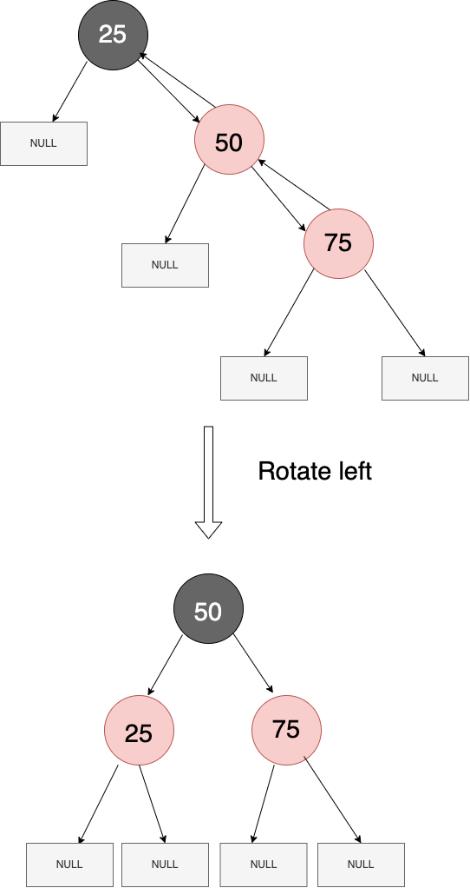

<h2 align = "center"> Notes </h2>

---

<h3> Insertion </h3>

Rotation is not always needed, sometimes pushing blackness is enough. <br>
But when can we do it? 

The answer is: If parent and its uncle are also red.
```
              ( 50 ) --> black (root)
                 |
red --> ( 20 ) -- -- ( 70 ) --> red
                 |
                  -- ( 90 ) --> red
```

In the case above, we can push blackness from the node with value 50. 
It changes its color to red, unless it is root.

Tree after pushing blackness:
```
              ( 50 )--> black 
                 |
black --> ( 20 ) -- -- ( 70 ) --> black 
                   |
                    -- ( 90 ) --> red
```

Everything is fine enough now!

<b> is_uncle_red function </b>

<b> C++  </b>

```cpp
bool is_uncle_red(Node *node) {
  if (!node) return false;

  bool is_left_red = node->left && node->left->color == 'r';
  bool is_right_red = node->right && node->right->color == 'r';

  if (is_left_red && is_right_red) return true;
  return false;
}
```

<b> push_blackness function C++ </b>

```cpp
void push_blackness(Node *node) {
    node->left->color = 'b';
    node->right->color = 'b';
    if (node != root) node->color = 'r';
}
```

#

---

#

<h3 align ="center"> 
If push_blackness can't be done, consider all possibilities 
</h3>

#

* <b>First scenario </b> - Node and its parent are both right children
  
        25 (black) --> Grandparent
         |
         -- 50 (red) --> Parent
            |
             -- 75 (red) --> Child

 Here, inserted node is right child, and it's parent is also right child.

 <b> rotate_left </b> is needed here! 👨‍💻 <br> <br>

  <b> Pseudocode </b>

     Grandparent->right = Parent->left 
     Parent->left = Grandparent
     if(Grandparent->parent){
          Parent->parent = Grandparent->parent;
          Grandparent->parent->value > Grandparent->value
              ? Grandparent->left = Parent;
              : Grandparent->right = Parent;
     } else { 
        root = Parent
     }

     Grandparent->parent = Parent
     Parent->left ? Parent->left->parent == Grandparent

  <b> C++ </b>

```c++
    void rotate_left(Node *node) {
    auto parent = node->parent;

    parent->color = 'r';
    node->color = 'b';
    parent->right = node->left;
    node->left = parent;

    if (parent->parent) {
      node->parent = parent->parent;

      if (node->parent->value > parent->value)
        parent->parent->left = node;
      else
        parent->parent->right = node;

    } else {
      node->parent = nullptr;
      root = node;
    }

    parent->parent = node;
    if (node->left) node->left->parent = parent;
   }
```

#

<h3 align="center"> Visualization </h3>

#



#

* <b>Second scenario</b> - Node and its parent are both left children
  
                75      (black) --> Grandparent
                |
           50 --         (red) --> Parent
           |
      25 --              (red) --> Child

Everything is pretty similar here, only the direction changes.

<b> rotate_right </b> is needed here! 👨‍💻 <br> <br>

<b> Pseudocode </b>

     Grandparent->left = Parent->right
     Parent->right = Grandparent
     if(Grandparent->parent){
          Parent->parent = Grandparent->parent;
          Grandparent->parent->value > Grandparent->value
              ? Grandparent->left = Parent;
              : Grandparent->right = Parent;
     } else { 
        root = Parent
     }

     Grandparent->parent = Parent
     Parent->right ? Parent->right->parent == Grandparent

  <b> C++ </b>

```c++
    void rotate_right(Node *node) {
        auto parent = node->parent;

        parent->color = 'r';
        node->color = 'b';
        parent->left = node->right;
        node->right = parent;

        if (parent->parent) {
            node->parent = parent->parent;

        if (node->parent->value > parent->value)
            parent->parent->left = node;
        else
            parent->parent->right = node;

        } else {
          node->parent = nullptr;
          root = node;
        }

        parent->parent = node;
        if (node->right) node->right->parent = parent;
    }
```

<h3> I believe visualization is not needed for this. </h3>

#

* <b> Third scenario</b> - Node is right child and its parent is left child 

                75       (black) --> Grandparent
                |
           50 --         (red) --> Parent
           |
            -- 60        (red) --> Child

 <b> single_rotate_left </b> is needed here! 👨‍💻 <br> <br>

With single rotation, changing color isn't happening, so the function looks slightly different.

```cpp
void single_rotate_left(Node* node) {
    auto parent = node->parent;
    auto tmp = node->right->left;
    node->parent = node->right;
    parent->left = node->right;
    node->right->parent = parent;
    node->right->left = node;
    node->right = tmp;
}
```

Now tree looks like that:
```
          75    <-- Still black
          |
     60 --      <-- Still red 
     |
50 --         <-- Stil red
```

It can be easily seen that this tree is not valid yet. But now we can just use our previous function 
- `rotate_right()` ! 😎

Now we have cool, valid tree:
```
          60    <-- black
          |
     50 --  -- 75   <-- Both are red now
```

* <b> Forth scenario</b> - Node is left child and its parent is right child 

                25       (black) --> Grandparent
                |
                -- 50      (red) --> Parent
                   |
              40 --        (red) --> Child

 <b> single_rotate_right </b> is needed here! 👨‍💻 <br> <br>

Everything is really analogous to third scenario, only direction differs

```cpp
void single_rotate_right(Node* node) {
  auto parent = node->parent;
  auto tmp = node->left->right;
  node->parent = node->left;
  parent->right = node->left;
  node->left->parent = parent;
  node->left->right= node;
  node->left = tmp;
}
```
